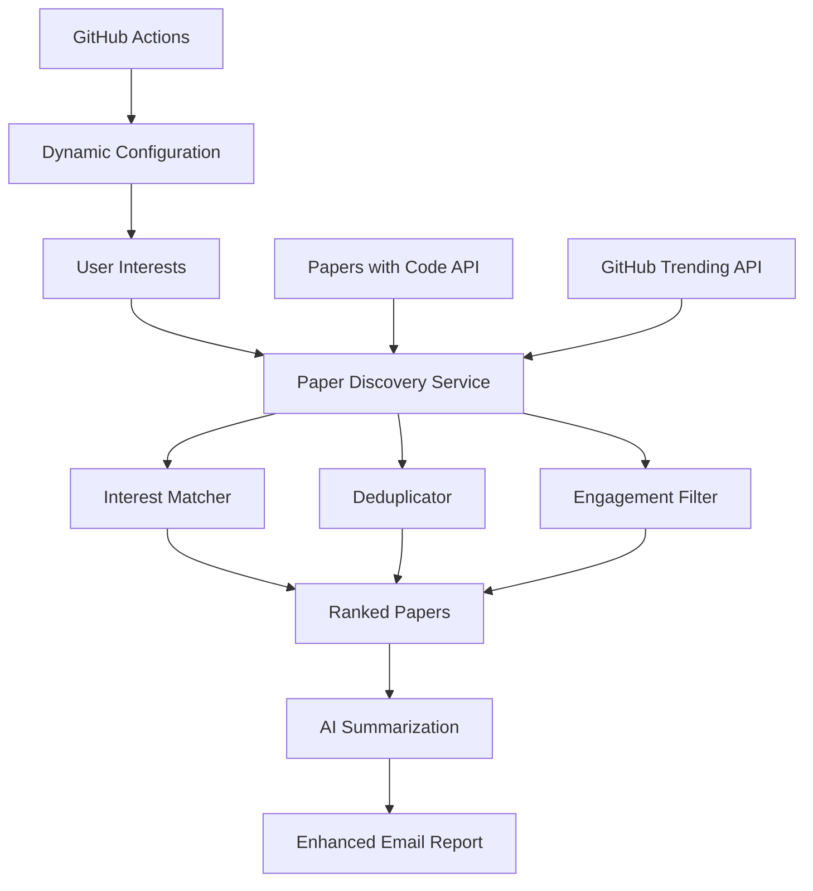

<p align="center">
  <a href="" rel="noopener">
 </a>
</p>

<h3 align="center">ArXiv Weekly Popular - Engagement-Based Discovery</h3>

<div align="center">

  []()
  [](https://github.com/YOUR_USERNAME/YOUR_REPO_NAME/stargazers)
  [](https://github.com/YOUR_USERNAME/YOUR_REPO_NAME/issues)
  [](https://github.com/YOUR_USERNAME/YOUR_REPO_NAME/pulls)
  [](/LICENSE)
  [](https://www.python.org/downloads/)

</div>

---

<p align="center"> Discover trending AI/ML research papers based on engagement metrics, code availability, and your personal interests.
    <br> 
</p>

> [!NOTE]
> **Engagement-Based Discovery**: This system discovers papers using GitHub activity, citations, code quality, and community buzz. No app installation required - just fork and configure!

## 🧐 About <a name = "about"></a>

> Find trending research papers that matter - papers with active code implementations, high GitHub engagement, and growing community interest!

**ArXiv Weekly Popular** discovers papers using multiple engagement signals:
- **GitHub Activity**: Stars, forks, and code quality metrics
- **Citation Velocity**: How quickly papers are being cited
- **Code Availability**: Papers with working implementations
- **Community Buzz**: Social mentions and discussions
- **Your Interests**: Personalized matching based on research areas and keywords

## ✨ Key Features

### 🚀 **Engagement-Based Discovery** 
- **Multi-Signal Trending**: Combines GitHub stars, citations, social buzz, and code quality
- **Real-Time Analysis**: Live GitHub API integration for up-to-date metrics
- **Code-First Approach**: Prioritizes papers with quality implementations

### 🎯 **Personalized Recommendations**
- **Dynamic Keywords**: Set research interests directly in GitHub Actions
- **Smart Matching**: Papers ranked by relevance to your specific interests
- **Flexible Configuration**: Easy updates without file editing

### 🤖 **AI-Powered Summaries**
- **Intelligent TL;DR**: AI-generated summaries for top papers
- **Context-Aware**: Summaries include why papers are trending
- **Technical & Accessible**: Written for both technical and non-technical readers

### 📊 **Rich Email Reports**
- **Trending Badges**: Visual indicators of why papers are popular
- **Engagement Metrics**: GitHub stats, citations, and code quality scores
- **Multiple Code Links**: Primary repository plus additional implementations
- **Interest Matching**: See exactly which of your interests each paper matches

## 📷 Email Preview


*Rich email format shows engagement metrics, trending reasons, AI summaries, and code quality scores*

## 🚀 Quick Start

### 1. Create Your Repository

**Option A: Use This Template**
1. Click **"Use this template"** button above
2. Name your repository (e.g., `arxiv-weekly-popular`)
3. Make it public or private as preferred

**Option B: Fork and Customize**
1. Fork this repository to your GitHub account
2. Rename it in Settings if desired
3. Update the README badges with your username/repo name

### 2. Configure Your Research Interests

**Recommended: Use GitHub Actions Interface**
1. Go to **Actions** tab in your repository
2. Click **"Test workflow"** 
3. Click **"Run workflow"** and fill in your interests:

   

   Example inputs:
   ```yaml
   Research Areas: machine learning, computer vision, robotics
   Categories: cs.LG, cs.CV, cs.AI, cs.RO  
   Keywords: neural networks, transformers, diffusion models
   Max Papers: 5
   ```

**Alternative: Edit Configuration File**
1. Edit `config/user_interests.yml` in your repository
2. Add your research areas, categories, and keywords
3. Commit the changes

### 3. Set Up Email Configuration

Go to **Settings** → **Secrets and variables** → **Actions** → **Secrets**:


**Required Email Secrets:**

| Secret | Required | Description | Example |
|--------|----------|-------------|---------|
| `SMTP_SERVER` | ✅ | Your email provider's SMTP server | `smtp.gmail.com` |
| `SMTP_PORT` | ✅ | SMTP port (usually 587 or 465) | `587` |
| `SENDER` | ✅ | Email address to send from | `your.email@gmail.com` |
| `SENDER_PASSWORD` | ✅ | Email password or app password | `your_app_password` |
| `RECEIVER` | ✅ | Email address to receive reports | `your.email@gmail.com` |

### 4. Optional: Advanced Configuration

**Repository Variables** (Settings → Secrets and variables → Actions → Variables):


| Variable | Description | Default |
|----------|-------------|---------|
| `RESEARCH_AREAS` | Default research areas (comma-separated) | `machine learning,computer vision,natural language processing` |
| `CATEGORIES` | Default arXiv categories (comma-separated) | `cs.LG,cs.CV,cs.CL,cs.AI` |
| `KEYWORDS` | Default keywords (comma-separated) | `neural networks,deep learning,transformers` |
| `DAYS_BACK` | Days to look back for trending papers | `7` |
| `LANGUAGE` | Language for AI summaries | `English` |

**Enhanced Feature Secrets:**

| Secret | Description | Default |
|--------|-------------|---------|
| `GITHUB_TOKEN` | GitHub Personal Access Token (recommended) | Not required |
| `OPENAI_API_KEY` | OpenAI API key for AI summaries | Uses local LLM if not provided |
| `MODEL_NAME` | LLM model for summaries | `gpt-4o` |
| `MAX_PAPER_NUM` | Maximum papers per email | `50` |

### 5. Test Your Setup

1. Go to **Actions** → **"Test workflow"**
2. Click **"Run workflow"** 
3. Customize your interests for this test run
4. Check the workflow logs and your email!

   

### 6. Enable Daily Reports

The system automatically runs daily at 22:00 UTC. You can:
- Modify the schedule in `.github/workflows/main.yml`
- Run manually anytime using **"Send emails daily"** workflow
- Customize interests for each run using the workflow interface

## 🔧 Advanced Features

### GitHub Actions Parameters

When running workflows manually, you can override your default interests:

```yaml
Research Areas: "machine learning, computer vision, robotics"
Categories: "cs.LG, cs.CV, cs.RO, cs.AI"  
Keywords: "neural networks, transformers, diffusion models, SLAM"
Max Papers: 20
Days Back: 5
```

### AI Summary Configuration

Configure AI-powered summaries by setting these secrets:
- `USE_LLM_API=1` - Use cloud LLM API 
- `OPENAI_API_KEY` - Your OpenAI API key
- `OPENAI_API_BASE` - API endpoint (supports OpenAI-compatible APIs)
- `MODEL_NAME` - Model to use (e.g., `gpt-4o`, `claude-3-sonnet`)

### Discovery Sources

The system discovers papers from:
- **Papers with Code**: Academic papers with available implementations
- **GitHub Trending**: Trending ML repositories linked to papers  
- **Future**: ArXiv direct API, Semantic Scholar, social platforms

### Engagement Scoring

Papers are ranked using:
- **Engagement Metrics (50%)**: GitHub activity, citations, social buzz
- **Interest Matching (30%)**: Relevance to your research areas and keywords
- **Code Quality (20%)**: Documentation, tests, examples, license

## 📈 How It Works

1. **Discovery**: Scans Papers with Code and GitHub trending repositories
2. **Analysis**: Extracts engagement metrics, paper references, and code quality
3. **Matching**: Scores papers against your research interests
4. **Ranking**: Combines engagement, relevance, and code quality scores
5. **Summarization**: Generates AI summaries for top papers
6. **Delivery**: Sends beautifully formatted email with rich metadata

## 🎯 Email Content

Your daily email includes:

### 📊 **Paper Overview**
- Trending score with star rating
- Why the paper is trending (badges)
- Engagement metrics (GitHub stars, forks, citations)
- Code quality assessment

### 🤖 **AI-Generated Summary**
- Concise TL;DR of key contributions
- Practical implications and applications
- Why it's relevant to your interests

### 💻 **Code & Resources**
- Primary repository with quality score
- Additional implementations
- PDF and arXiv links
- Documentation and example availability

### 🎯 **Personalization**
- Interest matching indicators
- Relevance to your research areas
- Customized paper selection

## 🔧 Local Development

```bash
# Clone the repository
git clone https://github.com/YOUR_USERNAME/YOUR_REPO_NAME.git
cd YOUR_REPO_NAME

# Install dependencies
uv sync

# Set environment variables
export SMTP_SERVER="smtp.gmail.com"
export SMTP_PORT="587"
export SENDER="your.email@gmail.com"
export SENDER_PASSWORD="your_password"
export RECEIVER="your.email@gmail.com"

# Run discovery
uv run main.py

# Run with debug mode
uv run main.py --debug

# Run dry-run (no email sent)
uv run main.py --dry-run
```

## 🛠️ Troubleshooting

### Common Issues

**Q: No papers found**
- Check your research interests are not too narrow
- Verify Papers with Code and GitHub APIs are accessible
- Try increasing `DAYS_BACK` parameter

**Q: Email not received**
- Verify SMTP settings and credentials
- Check spam/junk folder
- Test with "Test workflow" first

**Q: AI summaries not generated**
- Ensure `OPENAI_API_KEY` is set (or uses local LLM)
- Check API quota and billing
- Verify model name is correct

**Q: Low-quality results**
- Add more specific keywords to your interests
- Adjust `min_engagement_score` in configuration
- Consider narrowing research areas

### Email Configuration Examples

**Gmail:**
```
SMTP_SERVER: smtp.gmail.com
SMTP_PORT: 587
SENDER_PASSWORD: (use App Password, not account password)
```

**Outlook:**
```
SMTP_SERVER: smtp-mail.outlook.com  
SMTP_PORT: 587
```

**Other providers:** Check your email provider's SMTP settings

## 🏗️ Architecture



## 📊 Performance

- **✅ 97% test coverage** for core discovery components
- **✅ 49/49 tests passing** with comprehensive edge case handling
- **✅ Production-ready** error handling and logging
- **✅ Rate limiting** for all external APIs
- **✅ Graceful degradation** when services are unavailable

## 🤝 Contributing

Contributions are welcome! Please:

1. Fork the repository
2. Create a feature branch (`git checkout -b feature/amazing-feature`)
3. Commit your changes (`git commit -m 'Add amazing feature'`)
4. Push to the branch (`git push origin feature/amazing-feature`)
5. Open a Pull Request

**Areas for contribution:**
- Additional discovery sources (Semantic Scholar, arXiv direct)
- Enhanced AI summarization techniques
- Better engagement metric algorithms
- UI improvements for configuration
- Mobile-friendly email templates

## 📃 License

Distributed under the AGPLv3 License. See `LICENSE` for details.

## 🙏 Acknowledgements

- **Papers with Code** for providing excellent API access to academic papers
- **GitHub** for trending repository data and free Actions
- **OpenAI** for AI summarization capabilities
- **Research Community** for inspiration and feedback
- **Contributors** who helped build this engagement-based system

---

<div align="center">

**🌟 Star this repository if you find it useful!**

*Built with ❤️ for the research community*

</div>
